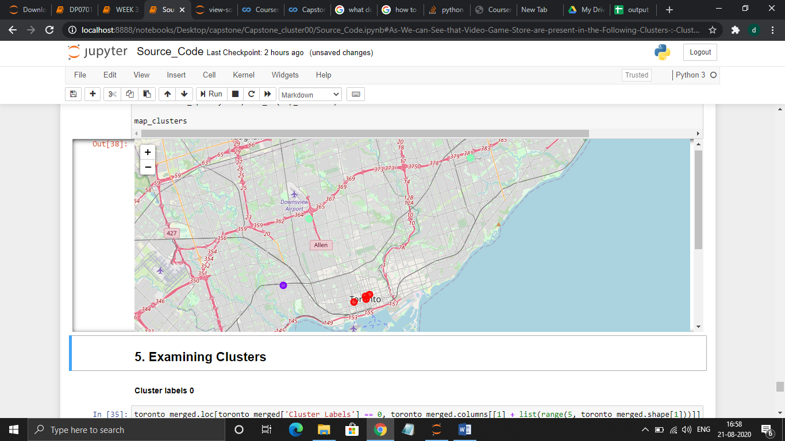

**Promotional Strategy for A Video Game store**

> Danial Monachan August 21, 2020

1.  Introduction
    ============

    1.  Background
        ----------

> For this project, the plan is to Build an efficient way for Video Game
> Store Owners to reach out to the crowd to enhance their Business.
> There are many numbers of games which are being released and to reach
> out to the public with a good plan can help in earning a good profit.

Problem
-------

> Data that might contribute to determining improvement in sales of the
> Video game vendor.
>
> This project aims to predict where to Pitch in for Advertisement with
> respect to area.

Target Audience
---------------

> The target audience are the Active Video Gamers in Canada.

2.  Data acquisition and cleaning
    =============================

    1.  Data sources
        ------------

The data used was :
 <https://en.wikipedia.org/wiki/List_of_postal_codes_of_Canada:_M>

This dataset consists of latitude and longitude, Postal codes.

Data cleaning
-------------

The content extraction will be done using foursquare API along with the
help of MS Excel geoCode For Scrapping the Web Table

Exploratory Data Analysis
=========================

Calculation of target variable
------------------------------

** **

1.  Get the list of neighbourhoods in Toronto, Canada by extracting the
    list of neighbourhoods from Wikipedia page. Web scraping using Excel
    is used to get tabular information from a webpage to data Frame.

2.  Then foursquare API is used to get the list of venues near these
    neighbourhoods.

3.  The Excel file is used to match the coordinates of the
    neighbourhoods.

4.  To confirm if the coordinates are correct, visualization is done
    using folium.

5.  Next is pulling the top 100 venues within a radius of 500 meters.

6.  The data that is extracted is name, venue, latitude and longitude.

7.  Then each neighbourhood is analyzed by checked for the frequency of
    occurrences of each venue category.

8.  Video Games stores are looked up.\
     

9.  They are transferred to a Data Frame.

10. K-means clustering is performed.

11. 3 clusters are obtained and the best one is selected.

Results
=======

{width="6.666666666666667in"
height="3.310416666666667in"}

3 clusters were generated:

-   Cluster 0: RED COLORED

-   Cluster 1: PURPLE COLORED

-   Cluster 2: GREENISH BLUE

Conclusions
===========

> Hence, the project on extracting and using data in the efficient
> decision making for a business problem with the help k-means
> clustering has been successfully completed.

Discussion
==========

-   Most of Game Stores are in Cluster 0, hence better chance of
    reaching the Promotional Criteria which is around Queens, St
    Patrick's and Queen's Park. Neighbourhoods with most Common Venues
    are grouped together the best area for Promotional Advertisements

-   The lowest stores in Cluster 1 on Dundas Street West. Neighbourhoods
    with NO much scope for Promotional Events but can be improved since
    they are near to Cluster 0.

-   In Cluster 2 the Neighbourhoods are relatively far and can only have
    minimal Exposure to promotional Advertisements.

-   Therefore, through the above analysis, the Promotional Events can
    attract more customers in Cluster 0
